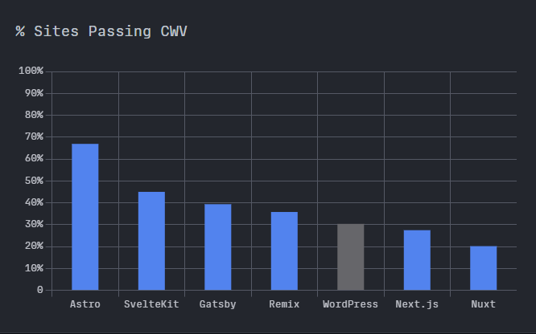
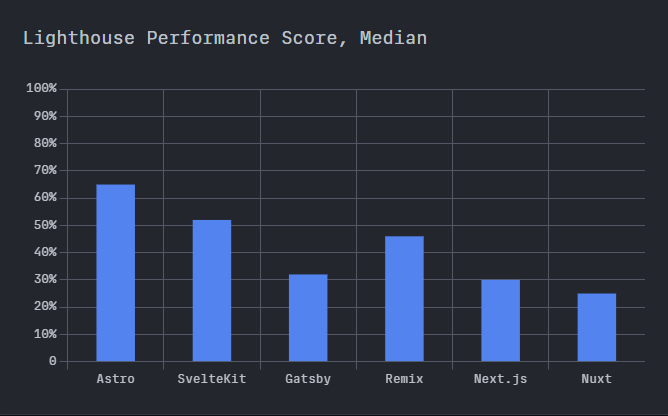

<PostLayout>
<main>

# Escolha do Astro.js pra esse blog

16 de Fevereiro, 2024

Quando a ideia de criar esse blog me veio à cabeça, sabia que teria uma escolha difícil entre qual framework escolher. Eram apenas duas opções, baseado na quantidade de elogios que via na internet: **Astro.js** e **Next.js**.

## Dúvida

Foi uma escolha difícil porque Next.js é um framework beeem estabelecido e elogiado. Eu já tinha usado Next.js uma vez num projeto de faculdade, mas acabei não concluindo porque meu professor da época instruiu todos os alunos a usarem PHP com Laravel pra normalizar os trabalhos. Então fui obrigado a deixar minha dashboard bem feita e polida em Next.js pra trás(mas gostei de usar Laravel)

Criando esse projeto, não encontrei problema nenhum e achei a curva de aprendizado do Next.js até bem confortável. Mas é aí que entrou a questão: se eu usei o Next.js, gostei e me adaptei rápido, por que usar o Astro né?

## É isso

Pensei um tempinho o que eu precisava.. foi aí que escolhi pensando na minha necessidade, que era simples

O framework tinha que atender a certos pontos:

1. **Suporte SSG**: Como meu principal foco na criação do blog é performance, sem dúvidas usar sites estáticos é de longe a melhor opção

2. **Suporte React**: Eu uso React em todos meus projetos, então ter suporte a React era um plus

3. **Suporte Markdown**: Até então nunca tinha usado arquivos .md na criação de sites, mas depois de analisar uns casos na internet, vi que pra criação de um website como um blog, é muito útil ter criação de conteúdo através de arquivos .md, ainda mais se se for um site SSG

Até ai tanto Astro como Next eram bons pra ser sincero

Mas não que isso tenha me deixado indeciso, a sacada foi ver o que cada framework me daria **além** do que eu precisava\
Simplificando: um site que seja rápido e tenha suporte a arquivos .md, sem interatividade

E aí eliminei o Next.js da minha escolha, seria overkill usar pra esse projeto simples, não teria rotas dinâmicas, API routes etc.\
**Fiquei com Astro**.

## Como eu me saí aprendendo Astro

Comecei, abri a documentação no site deles e comecei seco\
E sinceramente, foi muito mais fácil que qualquer outro framework que usei(até porque ele de fato é mais simples, emfim)

Aliás, um dos pontos que tinha levantado era o suporte com React, mas
não usei.\
Eu que tô há quase 3 anos usando apenas React nos meus projetos, resolvi usar os arquivos .astro mesmo

O motivo disso é a facilidade de criar tudo que eu precisava, performático e bem prático, sem sentir falta do React, me adaptei bem rápido com a sintaxe do Astro, consegui criar o projeto e todas funcionalidades que desejava bem rápido e sem bater muito a cabeça

## O fator decisivo foi números

O Astro se encaixou certinho e supriu todas as necessidades. Além disso, outras coisas me deixaram confiante na escolha, como esse gráfico de comparação com outros frameworks:

Comparação de performance no teste CWV

<a href="https://astro.build/blog/2023-web-framework-performance-report/">
Astro Blog 2023 Web Framework Performance Report
</a>

Comparação de performance no teste Lighthouse

<a href="https://astro.build/blog/2023-web-framework-performance-report/">
Astro Blog 2023 Web Framework Performance Report
</a>

São ótimos resultados e da pra ver que se saiu muito bem relacionado aos concorrentes

O teste **CWV** da primeira imagem é um teste com dados de pessoas do mundo real, é um jeito direto de ver como elas experienciam o site

Já o teste **Lighthouse** é mais focado pra performance do primeiro carregamento da página, basicamente o quão rápido a página carrega pro usuário poder usar

## Conclusão

Tive uma ótima experiência usando o Astro.js e recomendo a todos que possam estar na mesma posição que eu tava antes de criar esse blog, definitivamente vale a pena reservar pelo menos 1 hora pra criar um projeto em Astro e sentir como é o desenvolvimento com ele

E claro né, esse site é feito completamente em Astro então você pode tirar suas próprias conclusões e avaliar tudo que descrevi aqui

</main>
</PostLayout>
