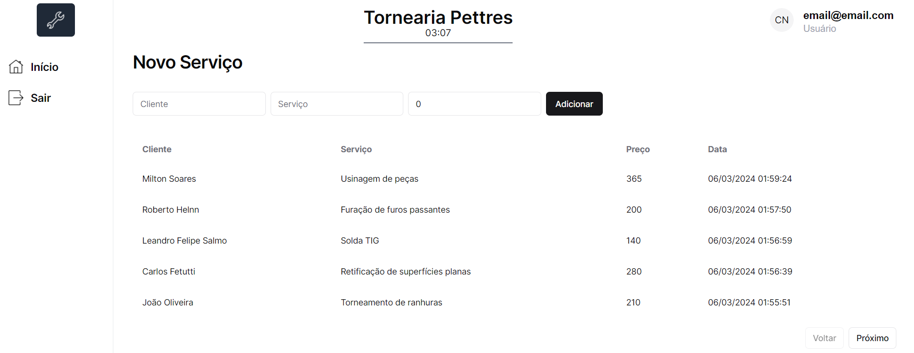

<PostLayout>
<main>

# Eu criei um Sistema de Registro de Vendas completo funcional

6 de Março, 2024

Se você leu a sessão Sobre deste site, você sabe que desde criança eu criava blogspots para várias coisas que eu gostava,
mas, uma vez tentei criar um blogspot para promover a empresa do meu pai, claro, como eu ainda era criança meu conhecimento na
época não era o suficente para eu conseguir atingir um resultado agradável, e acabei deixando de lado.

Então o desejo de inovar a empresa do meu pai já vem de um bom tempo atrás. Mas desta vez resolvi fazer algo diferente(e mais útil).
Criei um Sistema de Registro de Vendas, pois meu pai desde sempre, anota seu registro de vendas de serviço e registros de compras para
o estoque com notinhas, de papel.

Vendo isso, tomei a iniciativa e criei este projeto, utilizando Next.js e Shadcn Ui para a UI. O resultado final ficou assim:

## O que eu aprendi

Eu tinha usado Next.js apenas uma vez, e o motivo da escolha para este projeto é claro,
me permite um projeto com alta possibilidade de escalabilidade e rotas dinâmicas, tudo
o que um registro de vendas precisa.
Também utilizei PostgreSQL para armazenar as credenciais de login, junto com o
NextAuth.js, e criei um middleware simples para probir qualquer tentativa de acesso
sem uma sessão ativa.

Definitivamente a parte mais complicada foi a criação do middleware, foi a última feature que
implementei e foi a mais demorada, fiquei cerca de 2 dias testando vários e vários tipos e
lógicas diferentes, mas o que importa é que consegui, e claro, aprendi um conceito muito
útil e importante(com segurança não se brinca).

## Shadcn UI

Outra coisa que utilizei pela primeira vez foi o framework de UI, o Shadcn, e me surpreendi
com a facilidade de implementar os componentes, alterará-los e também com a vasta gama
de temas já prontos para utilizar.

Eu nunca tinha utilizado muito frameworks que utilizam Tailwind mas desta vez eu agradeço
por ter tentando denovo e sendo sincero, talvez daqui pra frente eu utilize apenas Tailwind
e aposente, por ora o SCSS. Ambos são ótimos mas gostei de como trabalhei o Tailwind.

Emfim, a criação deste sistema de vendas me deu muita experiência com conceitos que eu conhecia
mas não tinha aplicado em algo, que tinha necessidade de utilizá-los, quebrou certos preconceitos
com estas tecnologias, e o que mais aprecio: mais conhecimento pro meu acervo.

👋

</main>
</PostLayout>
